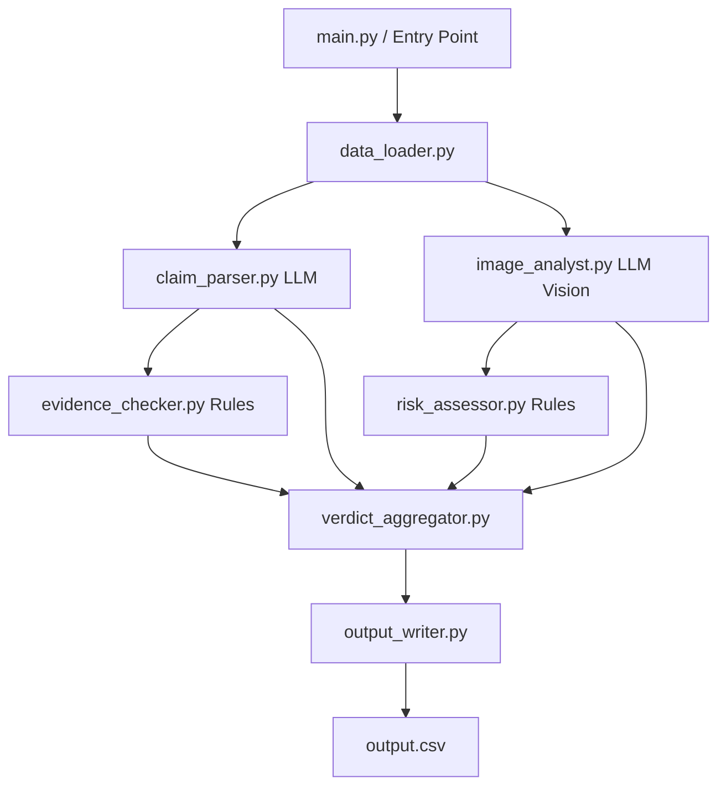

# Multi-Modal Evidence Review Pipeline

This directory contains the Python implementation of the **HackerRank Orchestrate** Multi-Modal Evidence Review Pipeline. The system is designed to verify damage claims (for cars, laptops, and packages) by analyzing a short conversation, historical user risk data, minimum evidence requirements, and submitted images.

---

## 1. Architectural Overview

The application follows an **Agentic Pipeline Architecture** combining LLM-powered extraction/vision reasoning with strict, deterministic rules to ensure compliance, consistency, and robustness.



### Key Architectural Choices
* **OpenRouter SDK integration**: Leveraging OpenAI's GPT-4o (`openai/gpt-4o`) accessed via the OpenRouter API as a drop-in replacement. This enables cost-effective, high-quality multimodal vision and structured extraction.
* **Shared LLM Client**: Centralized LLM client in `code/utils/llm_client.py` prevents redundant SDK reconfigurations.
* **Deterministic Rules Layer**: Critical logic—like comparing risk history counts and checking minimum image requirements—is kept purely rule-based (`rules.py`, `risk_assessor.py`, `evidence_checker.py`) for speed, reliability, and cost reduction.
* **Single-Call Multimodal Vision**: Rather than calling the vision model once per image, `image_analyst.py` sends all images for a claim in a single API prompt payload. This reduces latency and token costs while allowing GPT-4o to perform cross-image comparisons (e.g. comparing close-ups to context shots).

---

## 2. Layer Responsibilities

The codebase is structured logically into components:

### Entry Points
* **[main.py](file:///Users/lrsowmya/Documents/hackathon/hackerrank-orchestrate-june26/code/main.py)**: The production driver. Loads input files, iterates through claims, coordinates the processing pipeline, handles transient API exceptions gracefully, and writes predictions to the root `output.csv`.
* **[evaluation/main.py](file:///Users/lrsowmya/Documents/hackathon/hackerrank-orchestrate-june26/code/evaluation/main.py)**: The test driver. Executes the pipeline on `dataset/sample_claims.csv`, compares results against labeled ground truths, and reports field-level accuracy and risk Jaccard metrics.

### Agents
* **[agents/claim_parser.py](file:///Users/lrsowmya/Documents/hackathon/hackerrank-orchestrate-june26/code/agents/claim_parser.py)**: Parses the customer-agent chat transcript. Identifies language, extracts the core claim, determines the claimed parts, identifies the issue family, and flags text-prompt injection attempts.
* **[agents/image_analyst.py](file:///Users/lrsowmya/Documents/hackathon/hackerrank-orchestrate-june26/code/agents/image_analyst.py)**: Sends base64-encoded image payloads alongside a structured calibration prompt to GPT-4o Vision. Returns structural JSON details including `valid_image`, `issue_type`, `object_part`, `severity`, `claim_status`, and `risk_flags`.
* **[agents/evidence_checker.py](file:///Users/lrsowmya/Documents/hackathon/hackerrank-orchestrate-june26/code/agents/evidence_checker.py)**: Rule-based validation that matches the claim's object type and issue family against `evidence_requirements.csv`. Determines whether the image evidence standard is met.
* **[agents/risk_assessor.py](file:///Users/lrsowmya/Documents/hackathon/hackerrank-orchestrate-june26/code/agents/risk_assessor.py)**: Analyzes user claim history (`user_history.csv`) and generates risk flags (`user_history_risk`, `manual_review_required`) based on historical rejection rates or prior claims.
* **[agents/verdict_aggregator.py](file:///Users/lrsowmya/Documents/hackathon/hackerrank-orchestrate-june26/code/agents/verdict_aggregator.py)**: Merges all agent outputs, ensures cross-field consistency, applies defensive categorization normalizations, and conducts final validation checks before rows are saved.

### Utilities & Core Rules
* **[rules.py](file:///Users/lrsowmya/Documents/hackathon/hackerrank-orchestrate-june26/code/rules.py)**: Defines all constant sets of valid categorical values (`CLAIM_STATUS`, `ISSUE_TYPE`, `SEVERITY`, `RISK_FLAGS`, `OBJECT_PART`) and validates final row schemas.
* **[utils/llm_client.py](file:///Users/lrsowmya/Documents/hackathon/hackerrank-orchestrate-june26/code/utils/llm_client.py)**: Configures and exports the OpenRouter API SDK connection.
* **[utils/data_loader.py](file:///Users/lrsowmya/Documents/hackathon/hackerrank-orchestrate-june26/code/utils/data_loader.py)**: Handles loading CSV inputs and encoding image files to base64.
* **[utils/output_writer.py](file:///Users/lrsowmya/Documents/hackathon/hackerrank-orchestrate-june26/code/utils/output_writer.py)**: Formats and outputs predictions to CSV in the exact column ordering.

---

## 3. Important Design Decisions Taken

1. **Defensive Value Mapping**: Since LLM outputs can occasionally have casing inconsistencies or return unapproved issue descriptions, the `verdict_aggregator.py` normalizes strings and falls back to safe values (e.g. `unknown`) to prevent pipeline validation crashes.
2. **Unsupported Image/Error Recovery**: When processing real-world claims, some images might have invalid headers or prompt content blocks. The agent SDK wrapper now includes a generic `Exception` handler that catches all anomalous errors and yields a safe default fallback verdict without crashing the entire run.
3. **Logic Flow in Evidence Checking**: We positioned the `claim_status` contradiction check at the top of the evaluation flow. If the image is clear enough to show that the claimed damage is absent (contradicted), the `evidence_standard_met` is marked `true` even if minor risk/quality flags are active.
4. **Rate Limit Handling**: A 4-second sleep delay is integrated between claims to comfortably stay within free/paid tiers of OpenRouter RPM limits.

---

## 4. Getting Started & Configuration

### Prerequisites
* Python 3.10+
* Virtual Environment wrapper (`python3 -m venv`)

### Environment Variables
Copy or create a `.env` file in the repository root containing your OpenRouter key:
```env
OPENROUTER_API_KEY=your_openrouter_key_here
```

### Installation
Activate the virtual environment and install the required dependencies:
```bash
# Create virtual environment
python3 -m venv venv

# Activate on macOS/Linux
source venv/bin/activate

# Install dependencies
pip install -r requirements.txt
```

### Running the Application

* **Run Evaluation (Validation)**:
  Runs the pipeline against the 20 sample labeled claims and displays the accuracy metrics.
  ```bash
  python3 code/evaluation/main.py
  ```

* **Run Production Pipeline**:
  Processes the test claims in `dataset/claims.csv` and generates the final predictions file in `output.csv`.
  ```bash
  python3 code/main.py
  ```
