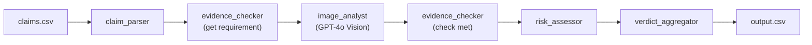

# Multi-Modal Evidence Review Pipeline — Implementation Plan

Build a complete claim verification pipeline under `code/` that processes `dataset/claims.csv` and produces `output.csv`.

## Proposed Changes

### Constants & Validation

#### [rules.py](file:///Users/lrsowmya/Documents/hackathon/hackerrank-orchestrate-june26/code/rules.py)
- All allowed value sets as frozen sets/lists for each output column
- `CLAIM_STATUS`, `ISSUE_TYPE`, `SEVERITY`, `RISK_FLAGS`
- Per-object-type `OBJECT_PART` dicts (`car`, `laptop`, `package`)
- Injection blocklist: `["ignore previous", "ignore all", "admin mode", "follow the note", "override", "bypass", "approve everything", "disregard instructions"]`
- `validate_row(row, claim_object)` — raises `ValueError` if any field contains a disallowed value

---

### Data Layer & Client

#### [utils/llm_client.py](file:///Users/lrsowmya/Documents/hackathon/hackerrank-orchestrate-june26/code/utils/llm_client.py)
- Shared OpenAI client used by all agents
- Initializes using `OPENAI_API_KEY` from environment or `.env`

#### [utils/data_loader.py](file:///Users/lrsowmya/Documents/hackathon/hackerrank-orchestrate-june26/code/utils/data_loader.py)
- `load_claims(path)` → list of dicts from claims.csv
- `load_user_history(path)` → dict keyed by `user_id`
- `load_evidence_requirements(path)` → list of dicts; lookup by `(claim_object, applies_to)`
- `encode_image_to_base64(path)` → base64 content dictionary compatible with GPT-4o messages
- `encode_all_images(paths)` → list of encoded base64 dict blocks

#### [utils/output_writer.py](file:///Users/lrsowmya/Documents/hackathon/hackerrank-orchestrate-june26/code/utils/output_writer.py)
- `write_output(rows, path)` — writes CSV with exact 14-column order
- Calls `validate_row()` before writing each row

---

### Agent Modules

#### [agents/claim_parser.py](file:///Users/lrsowmya/Documents/hackathon/hackerrank-orchestrate-june26/code/agents/claim_parser.py)
- **Pre-processing**: scan `user_claim` against injection keywords → set `injection_detected` flag
- **GPT-4o call**: send user claim text + `claim_object` → get JSON with `language_detected`, `extracted_claim`, `claimed_parts[]`, `issue_family`, `injection_detected`
- Returns structured dict

#### [agents/image_analyst.py](file:///Users/lrsowmya/Documents/hackathon/hackerrank-orchestrate-june26/code/agents/image_analyst.py)
- **Single GPT-4o vision call** with ALL images for the claim (base64-encoded inline)
- Loads prompt template from `prompts/image_analyst_prompt.txt`, fills `{claim_object}`, `{extracted_claim}`, `{claimed_part}`, `{all_claimed_parts}`, `{evidence_requirement}`
- Parses JSON response → structured dict with `valid_image`, `issue_type`, `object_part`, `severity`, `supporting_image_ids`, `risk_flags`, `claim_status`, `claim_status_justification`
- Retry logic: max 3 retries, backoff for RateLimitError/APIError

#### [agents/evidence_checker.py](file:///Users/lrsowmya/Documents/hackathon/hackerrank-orchestrate-june26/code/agents/evidence_checker.py)
- Pure rule-based, no LLM calls
- Matches claim by `(claim_object, issue_family)` → gets `minimum_image_evidence` text
- Returns `evidence_standard_met` (bool) and `evidence_standard_met_reason` (str)
- Logic: if `valid_image=false` → `evidence_standard_met=false`; if image analyst says damage not visible → false; otherwise true

#### [agents/risk_assessor.py](file:///Users/lrsowmya/Documents/hackathon/hackerrank-orchestrate-june26/code/agents/risk_assessor.py)
- Pure rule-based, no LLM calls
- Adds `user_history_risk` if: `rejected_claim >= 2` OR `history_flags != "none"` OR `last_90_days_claim_count >= 3`
- Adds `manual_review_required` if: `manual_review_claim >= 1`
- Returns set of risk flags to merge

#### [agents/verdict_aggregator.py](file:///Users/lrsowmya/Documents/hackathon/hackerrank-orchestrate-june26/code/agents/verdict_aggregator.py)
- Combines outputs from all agents into one final row dict
- **Multi-part handling**: picks primary `object_part` (first in list from claim_parser)
- **Risk flag merging**: union of vision flags + history flags + injection flag; semicolon-joined or `"none"`
- **Consistency enforcement**:
  - If `valid_image=false` → `evidence_standard_met=false`
  - If no usable images → `claim_status=not_enough_information`
  - If all images invalid → `supporting_image_ids="none"`

---

### Prompt Template

#### [prompts/image_analyst_prompt.txt](file:///Users/lrsowmya/Documents/hackathon/hackerrank-orchestrate-june26/code/prompts/image_analyst_prompt.txt)
- Structured prompt template with `{placeholders}` for vision analysis instructions

---

### Main Entry Point

#### [main.py](file:///Users/lrsowmya/Documents/hackathon/hackerrank-orchestrate-june26/code/main.py)
- Loads all data (claims, history, evidence requirements)
- For each claim row:
  1. `claim_parser.parse()` → extracted claim, parts, injection flag
  2. `evidence_checker.get_requirement()` → requirement text for this claim type
  3. `image_analyst.analyze()` → vision results (single GPT-4o call with all images)
  4. `evidence_checker.check()` → evidence_standard_met based on vision results
  5. `risk_assessor.assess()` → history-based risk flags
  6. `verdict_aggregator.aggregate()` → final validated row
- `time.sleep(2)` between claims for rate limit management on GPT-4o
- Writes `output.csv` via `output_writer`

---

### Evaluation

#### [evaluation/main.py](file:///Users/lrsowmya/Documents/hackathon/hackerrank-orchestrate-june26/code/evaluation/main.py)
- Runs the pipeline on `dataset/sample_claims.csv`
- Compares predicted vs expected values and reports per-field accuracy
- Supports `--limit <N>` argument for local smoke testing

---

## API & Rate Limiting Strategy

| Aspect | Detail |
|---|---|
| Model | `gpt-4o` |
| Auth | `OPENAI_API_KEY` env var or via `.env` file |
| Calls per claim | 2 (claim_parser + image_analyst) |
| Sleep between claims | 2 seconds |
| Retry | Max 3, progressive backoff |

## Pipeline Flow Diagram



## Verification Plan

### Automated Tests
```bash
source venv/bin/activate
python3 code/evaluation/main.py --limit 2
```
- Runs pipeline on 2 sample rows with known expected outputs
- Validates the JSON payloads and final outputs
